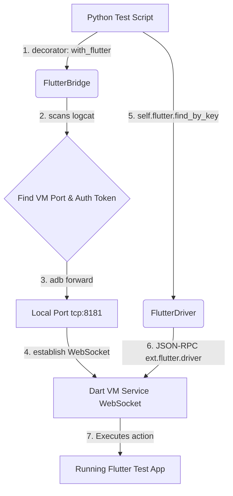

# u2_flutter 🚀

[](https://pypi.org/project/u2-flutter/)
[](https://pypi.org/project/u2-flutter/)
[](https://github.com/assassinaj602/u2_flutter/blob/main/LICENSE)
[](http://makeapullrequest.com)
[](https://github.com/assassinaj602/Kea2)
[](https://github.com/assassinaj602/u2_flutter)

A standalone Python package and plugin for `uiautomator2` designed to find, inspect, and interact with Flutter widgets. It connects to the Dart VM Service over a WebSocket connection using ADB port forwarding to send JSON-RPC commands directly to Flutter's Driver extension.

> [!NOTE]
> This project is inspired by the `u2_webview` extension pattern and is built to integrate as a core driver option in **Kea2** fuzzing environments.

---

## 🛠️ Status: ✅ ALL PHASES COMPLETE!

We have successfully built and verified all milestones of the roadmap:
* **[x] Phase 1**: Standalone prototype showing element finding and interactive tapping/typing.
* **[x] Phase 2**: Standardized APIs and built a comprehensive 19-test mock unit test suite.
* **[x] Phase 3**: Fully integrated into the **Kea2** fuzzing loop to check preconditions fast (<1ms) and perform script-guided testing.

---

## ✨ Features

- **Direct WebSocket Transport**: Bypasses heavy middleware (e.g. Node.js/Appium) by speaking JSON-RPC 2.0 directly to the Dart VM Service.
- **Fluent & Chainable Element API**: Interact with widgets easily using patterns like `self.flutter.find_by_key("submit_btn").tap()`.
- **Diagnostics Tree Caching**: Fetches and caches the full Widget diagnostics tree (`get_diagnostics_tree()` & `cache_widget_tree()`) for fast static checker lookups.
- **Scroll & WaitFor Commands**: Native scroll and wait commands mapped directly to the Flutter extension (`scroll()` & `wait_for()`).
- **Kea2 Integration**: Integrated as a core driver option in **Kea2** fuzzing engine.
- **Hybrid App Support**: Concurrently injects both `self.d` (native Android checking) and `self.flutter` (Flutter checking) into test class instances.
- **Lifecycle Decorator**: Managed connection state using `@with_flutter` to guarantee automated attach and detach logic.
- **Isolate ID Caching**: Minimizes unnecessary VM queries, caching the Isolate ID for fast execution.

---

## 🏗️ How it Works Under the Hood

The communication pipeline runs as follows:



1. **Service Registration**: The Flutter application is built with the `flutter_driver` dependency and starts the VM service using `enableFlutterDriverExtension()`.
2. **Bridge Handshake**: `u2_flutter` parses the `logcat` output of the device to capture the dynamic VM Service port and the required security `auth token`.
3. **Port Forwarding**: Standard ADB commands map the local port (`8181`) to the dynamic device VM port.
4. **WebSocket Transport**: Opens a WebSocket connection directly into the Dart VM Service (`ws://127.0.0.1:8181/<token>/ws`).
5. **Command Dispatch**: Constructs JSON-RPC 2.0 requests with driver-specific payloads (e.g. `tap`, `enter_text`, `get_text`) and routes them directly to the active Dart isolate.

---

## 📦 Project Structure

```text
u2_flutter/
├── u2_flutter/
│   ├── __init__.py           # Package entry point
│   ├── flutter_bridge.py     # Logcat scanning, port forwarding, socket connection
│   ├── flutter_driver.py     # JSON-RPC command assembly, isolate caching, finders
│   └── flutter_plugin.py     # Plugin wrapper and @with_flutter decorator
├── kea2_integration/
│   ├── __init__.py           # Exposes integration checkers/drivers
│   ├── flutter_static_checker.py  # Static checker for Kea2
│   └── flutter_script_driver.py   # Script driver for Kea2
├── test_app/                 # Example Flutter test application
├── examples/
│   └── test_script.py        # Complete execution test scenario
├── tests/                    # Project unit tests
├── requirements.txt
└── setup.py
```

---

## 🚀 Getting Started

### 1. Prerequisites
Ensure you have the Flutter SDK and Python 3.7+ installed.

### 2. Setting Up the Flutter App
The Flutter application must enable the Driver extension inside `lib/main.dart`:

```dart
import 'package:flutter/material.dart';
import 'package:flutter_driver/driver_extension.dart';

void main() {
  enableFlutterDriverExtension(); // Register ext.flutter.driver service
  runApp(const MyApp());
}
```

Add the `flutter_driver` dependency to your `pubspec.yaml`:
```yaml
dev_dependencies:
  flutter_driver:
    sdk: flutter
```

Build the debug APK (debug builds automatically expose the VM Service):
```bash
cd test_app
flutter build apk --debug
```

### 3. Running the Python Test Script
Set up the python virtual environment, install dependencies, and run:

```bash
# Set up venv
python -m venv venv
venv\Scripts\activate  # On Linux/macOS: source venv/bin/activate

# Install requirements
pip install -e .

# Run the test script
python examples/test_script.py
```

---

## 📝 Example Usage

Here is a quick look at how you can write a test case using the `@with_flutter` decorator:

```python
import uiautomator2 as u2
from u2_flutter import with_flutter

class MyTestClass:
    def __init__(self):
        self.d = u2.connect() # uiautomator2 device instance at self.d

    @with_flutter(local_port=8181)
    def test_my_app(self):
        # Find a TextField by Key and enter text
        self.flutter.find_by_key("username_input").enter_text("testuser")
        
        # Tap the Submit button
        self.flutter.find_by_key("submit_btn").tap()
        
        # Read the updated greeting text
        greeting = self.flutter.find_by_key("greeting_text").text
        print(f"Result: {greeting}")
        assert greeting == "Hello, testuser!"
```

---

## ⚙️ Kea2 Integration

`u2_flutter` integrates natively as a core driver option in **Kea2** fuzzing environments to test hybrid and pure Flutter applications.

### 1. Installation

Install the package in editable mode inside the Kea2 virtual environment:

```bash
pip install -e D:\New folder (4)\u2_flutter
```

### 2. CLI Invocation

To start a fuzzing exploration session with Flutter mode enabled, pass the `--flutter` flag:

```bash
python -m kea2.cli --apk path/to/your/app.apk --package-name your.package.name --flutter properties/your_test_file.py
```

### 3. Hybrid Test Example

Inject both `self.d` (native Android elements) and `self.flutter` (Flutter elements) inside your properties:

```python
import unittest
from kea2 import precondition, prob

class TestHybridApp(unittest.TestCase):
    @precondition(lambda self: self.d(text="Continue").exists)
    def click_native_continue_button(self):
        self.d(text="Continue").click()

    @precondition(
        lambda self: self.d(resourceId="android:id/statusBarBackground").exists
        and self.flutter.find_by_key("flutter_input").exists
    )
    def fill_flutter_input(self):
        self.flutter.find_by_key("flutter_input").enter_text("hybrid_value")
```

---

## ⚖️ Why `u2_flutter`? (vs. Appium Flutter Driver)

`u2_flutter` is designed following the **`uiautomator2` philosophy**: small, lean, and extremely fast.

| Metric / Aspect | Appium Flutter Driver | `u2_flutter` |
| :--- | :--- | :--- |
| **Pipeline Length** | HTTP → WebDriver → Node.js → ADB → Dart VM | Direct WebSocket over ADB Forward |
| **Network Hops** | 4+ hops | **1 hop** (Local WebSocket) |
| **Middleware** | Appium Server (Node.js) required | **None** (pure Python dependencies) |
| **Precondition Checks** | Network request per check (>150ms) | Local JSON tree query cache (**<1ms**) |
| **Setup Overhead** | Complex (npm, system dependencies) | Trivial (`pip install`) |

---

## 🛣️ Roadmap

- [x] **Phase 1**: Standalone plugin with bridge, driver, and decorators.
- [x] **Phase 2**: Align APIs and write comprehensive unit tests.
- [x] **Phase 3**: Integrate `FlutterStaticChecker` and `FlutterScriptDriver` into **Kea2** ([Pull Request Submitted](https://github.com/assassinaj602/Kea2/pull/new/feature/flutter-integration)).

---

## 🤝 Acknowledgments & Credits

- [uiautomator2](https://github.com/openatx/uiautomator2) - The underlying Android UI automation engine used.
- [u2_webview](https://github.com/openatx/u2_webview) - The Flask-extension pattern that inspired this plugin architecture.
