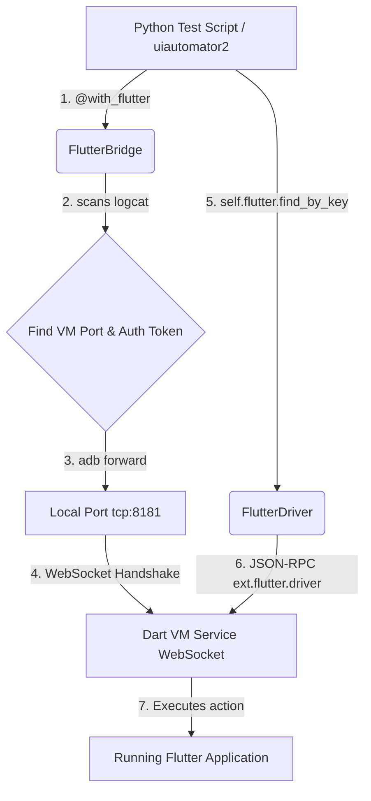

# u2_flutter 🚀

[](https://pypi.org/project/u2-flutter/)
[](https://pypi.org/project/u2-flutter/)
[](https://github.com/assassinaj602/u2_flutter/blob/main/LICENSE)

`u2_flutter` is a lightweight Python plugin for [`uiautomator2`](https://github.com/openatx/uiautomator2) designed to inspect, locate, and interact with Flutter widgets in Android applications.

It connects directly to the Dart VM Service over a WebSocket connection using ADB port forwarding, sending JSON-RPC commands directly to Flutter's Driver extension (`ext.flutter.driver`).

---

## ✨ Key Features

- **Direct WebSocket Connection**: Bypasses heavy HTTP/Node.js middleware (e.g., Appium) by communicating directly with the Dart VM Service over WebSocket.
- **Fluent Element API**: Easily locate widgets by Key, Type, Text, or Value and perform actions like `tap()`, `enter_text()`, and `text`.
- **Automatic Bridge Lifecycle**: Managed `@with_flutter` decorator handles dynamic logcat scanning, port forwarding, and connection lifecycle automatically.
- **Fast Diagnostics Tree Inspection**: Supports fetching and caching the Flutter widget diagnostics tree (`get_diagnostics_tree()`) for fast offline or precondition checks (<1ms).
- **Hybrid App Compatibility**: Works seamlessly alongside standard `uiautomator2` native Android interactions (`self.d` for native, `self.flutter` for Flutter).

---

## 🛠️ How it Works


```mermaid
graph TD
    A[Python Test Script / uiautomator2] -->|1. @with_flutter| B(FlutterBridge)
    B -->|2. scans logcat| C{Find VM Port & Auth Token}
    C -->|3. adb forward| D[Local Port tcp:8181]
    D -->|4. WebSocket Handshake| E[Dart VM Service WebSocket]
    A -->|5. self.flutter.find_by_key| F(FlutterDriver)
    F -->|6. JSON-RPC ext.flutter.driver| E
    E -->|7. Executes action| G[Running Flutter Application]
```

1. **Service Registration**: The Flutter app is built in debug mode with `enableFlutterDriverExtension()` inside `lib/main.dart`.
2. **Dynamic Handshake**: `u2_flutter` scans `logcat` for the active Dart VM Service port and security authentication token.
3. **Port Forwarding**: Automatically sets up `adb forward tcp:8181 tcp:<vm_port>`.
4. **WebSocket Communication**: Establishes a WebSocket connection (`ws://127.0.0.1:8181/<token>/ws`) to execute driver commands directly on the running isolate.

---

## 📦 Installation

```bash
pip install u2-flutter
```

---

## 🚀 Quick Start (Basic Usage with `uiautomator2`)

### 1. Enable Flutter Driver Extension in your App

Inside your Flutter app's `lib/main.dart`:

```dart
import 'package:flutter/material.dart';
import 'package:flutter_driver/driver_extension.dart';

void main() {
  enableFlutterDriverExtension(); // Registers ext.flutter.driver
  runApp(const MyApp());
}
```

Add `flutter_driver` to `pubspec.yaml`:

```yaml
dev_dependencies:
  flutter_driver:
    sdk: flutter
```

Build the debug APK:
```bash
flutter build apk --debug
```

### 2. Write Python Automation Script

```python
import unittest
import uiautomator2 as u2
from u2_flutter import with_flutter

class FlutterAppTest(unittest.TestCase):
    @classmethod
    def setUpClass(cls):
        cls.d = u2.connect()  # Connect uiautomator2 device instance

    @with_flutter
    def test_login_flow(self):
        # 1. Native uiautomator2 interaction
        self.d(text="OPEN FLUTTER").click()

        # 2. u2_flutter widget interactions
        self.flutter.find_by_key("username_input").enter_text("testuser")
        self.flutter.find_by_key("submit_btn").tap()

        # 3. Read updated widget state
        greeting = self.flutter.find_by_key("greeting_text").text
        self.assertEqual(greeting, "Hello, testuser!")

if __name__ == "__main__":
    unittest.main()
```

---

## 🔌 Using with Kea2 Fuzzing Framework

`u2_flutter` also serves as the official Flutter interaction plugin for **Kea2** (property-based fuzzing testing for Android).

### Example Property Test

```python
import unittest
import logging
from kea2 import precondition, prob
from u2_flutter import with_flutter

logger = logging.getLogger(__name__)

class TestHybridApp(unittest.TestCase):

    @with_flutter
    @prob(1.0)
    @precondition(lambda self: self.d(text="OPEN FLUTTER").exists)
    def test_native_to_flutter_flow(self):
        # Native click
        self.d(text="OPEN FLUTTER").click()

        # Flutter widget checks & actions
        assert self.flutter.find_by_key("HomeListView").exists
        
        before_text = self.flutter.find_by_key("statusText").text
        before_count = int(before_text.split(":")[1].strip())

        self.flutter.find_by_key("actionButton").tap()

        after_text = self.flutter.find_by_key("statusText").text
        after_count = int(after_text.split(":")[1].strip())

        assert after_count == before_count + 1
```

---

## ⚡ Performance & Comparison

Compared to Appium Flutter Driver, `u2_flutter` follows the lean **`uiautomator2` design philosophy**:

| Metric | Appium Flutter Driver | `u2_flutter` |
| :--- | :--- | :--- |
| **Transport** | HTTP → WebDriver → Node.js → ADB → Dart VM | Direct WebSocket over ADB Forward |
| **Network Hops** | 4+ hops | **1 hop** (Local WebSocket) |
| **Middleware** | Appium Server (Node.js) required | **None** (pure Python) |
| **Widget Query Latency** | >150ms per request | **<1ms** (cached diagnostics tree) |
| **Setup Complexity** | High (npm, appium server, drivers) | Minimal (`pip install u2-flutter`) |

---

## 🤝 Acknowledgments

- [openatx/uiautomator2](https://github.com/openatx/uiautomator2) — The Android UI automation framework.
- [u2_webview](https://github.com/YuYoungG/uiautomator2-webview) — The plugin pattern architecture that inspired this project.

---

## 📜 License

[MIT License](LICENSE) © Muhammad Assad Ullah
